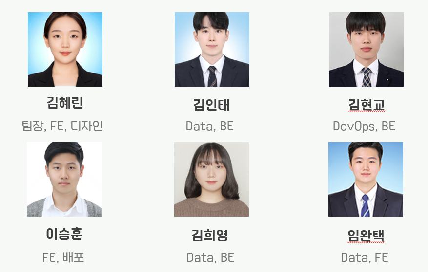

# README

# 책크인 (CHAEK-IN)

## 1. 서비스 소개

---

### 서비스 개요

- 진행 기간 : 2022.08.29~2022.10.07(6주)
- 한 줄 소개 : 책 속으로 여행이 더 설레게
- 서비스 명 : 책크인(CHAEK-IN)

### 기획 배경

- 내가 읽은 책을 쉽게 기록하고, 좋아할 만한 책을 추천 받고 그것을 바탕으로 다양한 사람들과 독서 모임을 할 수 있는 종합 독서 어플리케이션
    - 유저가 좋아할 만한 책을 유저의 책 선호 데이터를 기반으로 추천
    - 완독 모임, 유저와 비슷한 사람들의 모임 등 다양한 독서 모임 추천
    - 바코드 리더 기술과 ISBN을 활용한 독서 기록
    - OCR 기술을 활용한 간편한 책 속 문장 기록

### 서비스 화면


회원 가입, 초기 정보 수집


홈 화면, 책 읽기 시작


책 읽기 끝, 책 상세, 리뷰, OCR 기록


책 추천 


독서 모임 추천


마이페이지(책 달력, 읽고있는 책, 찜한 책, 읽은 책)

### 팀원 소개



### UCC

[https://youtu.be/tjm-BSuf-mc](https://youtu.be/tjm-BSuf-mc)

## 2. 기획

---

### ERD


### Figma

[https://www.figma.com/file/UdFN1ZLH4m3ajfb3syvtnu/책크인?node-id=0%3A1](https://www.figma.com/file/UdFN1ZLH4m3ajfb3syvtnu/%EC%B1%85%ED%81%AC%EC%9D%B8?node-id=0%3A1)


### API 명세


## 3. 기술 스택

---

### Architecture


### Frontend


- React : 18.0.0
- React Native : 0.69.5

### Backend


- Spring boot : 2.7.4
- QueryDSL : 1.0.10
- mariaDB : 10.6.8

### Data


- FastAPI : 0.85.0

### Infra


- docker : 20.10.18
- Jenkins : 2.60.3
- redis : 7.0.5

### IDE

- Intellij : 2022.01.03 (community)

## 4. 프로젝트 진행

---

### Git

- Git Flow를 브랜치 전략으로 선정
- Develop 브랜치와 Master 브랜치에 MR을 Merge하면, GitLab Webhook이 발생하고 Jenkins를 이용하여 자동 배포 환경 구현
- Develop 브랜치에 Merge되는 순간 Spring, FastAPI 코드로 Docker Image 생성
- Master 브랜치에 Merge되는 순간 Docker Image를 Run하여 자동 배포
- Git commit convention
    
    ```markdown
    ✨ feat : 기능 (새로운 기능)
    🐛 fix : 버그 (버그 수정)
    ♻ refactor : 리팩토링
    💄 style : 스타일 (코드 형식, 세미콜론 추가: 비즈니스 로직에 변경 없음)
    📝 docs : 문서 (문서 추가, 수정, 삭제)
    ✅ test : 테스트 (테스트 코드 추가, 수정, 삭제: 비즈니스 로직에 변경 없음)
    🔨 chore : 기타 변경사항 (빌드 스크립트 수정 등)
    ```
    

### Jira

- 개발 일정 관리


### Notion

[https://pear-alder-eb9.notion.site/87831935456e4da7a1d9b9e7a05c92cd](https://www.notion.so/87831935456e4da7a1d9b9e7a05c92cd)


## 5. 느낀점

---

### 김혜린

처음으로 React Native와 Expo를 활용해 모바일 어플리케이션을 개발하는 새로운 경험이었다. Vue3와 마찬가지로 한글 자료가 많지 않아서 초기 설정부터 외국 유튜브 영상으로 공부하고 시작해서 잘 실행이 될까 걱정도 됐지만 결국 서비스를 끝까지 만들고 출시할 수 있어 뿌듯했다. Google Cloud Vision API를 활용해 OCR 기술을 구현해 본 것도 뜻깊은 경험이었다. 이전의 프로젝트들과 달리 프로젝트 중간에 기획에 변경이 많았는데, 어려운 순간들도 있었지만 열심히 기획을 다잡는데 참여해준 팀원들 덕분에 좋은 서비스를 만들 수 있었던 것 같다.

### 김인태

Python과 Fast API를 이용해 추천 서버를 구성해보았다. JAVA와 Spring FrameWork를 주로 이용해 백엔드 서버를 구축한 나에게는 새로운 경험과 도전이 되었다. 추천 서버 구성 과정에서 추천에서 오랜 연산 시간으로 인해 서버가 다운되는 어려움이 있었다. 이를 해결하기 위해 추천 연산의 갱신이 필요하지 않는한 기존의 연산 결과를 저장하고 이를 캐시처럼 이용하면 응답시간을 줄일 수 있을거라 생각했다. 그래서 캐시 서버로 redis를 적용해 보았고 30초 걸리던 응답시간을 약 0.01초로 대폭 줄일 수 있었다.

응답시간을 줄였지만 로컬에서 사용하던 redis를 Docker 환경으로 올리는 과정에서 추천 서버와 캐시 서버가 연결이 되지 않는 문제를 겪었다. 원인은 Docker 설정과 redis 설정이 맞지 않아서였고 설정을 맞춰준 후 연결이 정상적으로 이루어졌다. 이 과정에서 Jenkins와 Docker 를 이용한 CI / CD 과정을 새로이 배울 수 있었다.

데이터 서버와 캐시 서버가 정상적으로 연결된 이 후 에는 캐시 서버에 등록된 key가 주기적으로 삭제되고 이상한 키가 등록되는 문제가 있었다. 검색을 통해 확인해 본 결과 Docker에 redis 설정 시 비밀번호를 설정하지 않으면 크롤러봇에 의해 key와 value가 삭제되고 악의적인 스크립트가 등록될 수 있음을 알 수 있었다. 이러한 내용을 알게된 후 redis 비밀번호를 설정하고 봇에 의해 등록된 키를 제거하니 이 후 정상적으로 등록된 키는 삭제되지 않았다.

이 외에도 로그인한 사용자만 추천 서비스를 이용할 수 있도록 Fast API에 JWT Dependency를 주입하였다. 동작 과정을 설명하자면 JAVA 백엔드 서버에서 로그인을 통해 키가 발급된다. 이 후 키를 클라이언트가 가지고 있다 추천 요청 시 헤더에 Authorization으로 담아 보내 준다. 그러면 Fast API의 엔드포인트에서 이를 Dependency로 받아 검증하고 통과한 사용자만 서비스를 이용할 수 있는 구조이다. 

하지만 어떤 이유에서인지 검증이 실패되어 서비스가 동작하지 않았다. 원인을 찾기 위해 에러 로그를 분석 하였고 Python JWT 라이브러리 내부에서 엔드포인트로 넘어온 Authorization을 복호화 해서 얻은 내용 중 시그니쳐라는 정보와 복호화를 위해 등록한 시크릿 키의 정보가 일치하지 않아 발생하는 문제임을 알 수 있었다. 실제로 시그니쳐와 키를 매칭하는 코드를 주석처리하니 복호화 된 인증 정보에서 필요한 사용자 정보는 얻을 수 있었다. 

JAVA 백엔드 서버에서 토큰 발급시 사용한 키와 Fast API 백엔드 서버에서 토큰 복호화를 위해 사용한 키가 동일한데 복호화가 이루어지지 않는 점은 이상했다.

개발 시간 상의 문제로 검증 단계를 주석 처리하여 편법으로 넘어갈 수 있었다. 하지만 그렇게 되면 인증의 의미가 사라져 인증을 제거하고 사용자 id를 넘겨주어 서비스는 정상 작동하도록 하였다.

이 부분을 당시에 해결하지 못한 것은 아쉬운 점이다. 하지만 이 과정에서 로그를 통해 원인을 찾을 수 있음을 배웠고, 라이브러리 내부를 확인하고 원인을 실제로 발견함으로써 막연한 두려움으로 공식 라이브러리 내부를 확인하지 않는 것을 이겨낼 수 있었다. 

짧은 개발 시간으로 인해 아쉬운 점도 많았지만 좋은 팀원들을 만나 새로운 것을 도전하고 배울 수 있아 매우 뜻깊고 감사한 시간이었다.

### 김현교

Jenkins와 Docker를 이용하여 CI / CD 환경을 구축하고, EC2를 관리하며 아키텍처 지식을 향상 시킬 수 있었다. 그리고 이전 프로젝트보다 로깅도 강화하고, JPA Batch Insert 문제 등을 겪으며 기술적으로 더 깊이를 가져갈 수 있었다. 이런 저런 일정으로 인해 초기에 기획한 서버 성능 테스트 등을 수행하지 못해 아쉽고 다음 프로젝트에서는 반드시 성능을 체크하고 개선하며 서버 개발자로서 한 층 더 성장하고 싶다.

### 김희영

 평소 어떤 식으로 동작하는지 궁금했던 추천 알고리즘에 대해 많이 배울 수 있어서 뜻깊었던 프로젝트였다. 특히 이론적인 내용만 알고 있었던 협업 필터링 알고리즘을 이용하여 책 추천을 구현할 수 있어서 뿌듯했다. 협업 필터링 알고리즘을 구현하기 위해 도서에 대한 유저의 평점 데이터가 필요했는데 설문조사를 통해 데이터를 모으고 전처리 후 DB에 저장하는 과정을 거쳤다.

 추천과 관련된 기능은 파이썬을 이용해서, 그 외의 기능은 자바를 이용해서 프로젝트를 진행했는데 두 가지 언어를 함께 사용하는 새로운 경험이었다. 특히 FastAPI라는 새로운 프레임워크를 사용했다는 부분이 그랬다. 스프링으로는 이전 프로젝트에서 매우 해보고 싶었지만 시간상 불가능했던 코드 리뷰를 경험할 수 있었다. 서로의 코드를 보는 것은 생각보다 시간과 집중력을 요하는 작업이었다. 독후감 API를 만들었지만 기획 방향이 달라지면서 기능이 없어져서 사용하지 않게 된 슬픈 경험도 해볼 수 있었다.

### 이승훈

1. 2학기 커리큘럼은 공통 프로젝트 / 특화 프로젝트 / 자율 프로젝트로 나눠져 있다.  공통 프로젝트의 목적은 S/W 개발자 수요가 높은 웹/모바일 서비스 개발 경험, 특화 프로젝트의 목적은 4차 산업혁명 프로젝트 경험이라고 한다. 그런데 나는 본의 아니게 일반적인 웹/모바일 서비스 개발 경험을 할 수 없었다. 프론트엔드 개발자로써 해야 할 일, 백엔드 팀원들과 소통하는 방법, 웹/모바일 서비스 개발 프로젝트의 일반적인 업무 시퀀스 등을 제대로 익히지 못한 채로 특화 프로젝트를 시작하게 되었고 다른 사람들이 공통 프로젝트 할 때 겪었던 시행착오를 나는 이번에 좀 겪게 된 것 같다. 아직도 기억에 남는 말이 왜 프론트엔드인 내가 다 하려고 하느냐, 나눠서 해야 할 일이다 라는 피드백이다.
2. 기획 단계에서의 어려움도 제대로 느꼈다. 나와 다른 팀원들과 컨설턴트님의 서로 다른 의견들을 조율하는 과정에서 나의 언어로 하여금 상대방을 이해시키는 것이 상상 이상으로 어려운 일임을 깨달았다. 업무적 언어와 일상 언어를 제대로 구분하고 사용하는 연습을 더 해야 할 것 같다. 디자인적인 역량도 나에게 1도 없다는 것을 깨달았다. 현업 가면 전문 디자이너와 기획팀, PM 등이 다 나눠져 있어 내가 안해도 된다는 것이 정말 다행이다.
3. 저번 프로젝트는 React기반에 PWA를 도입해서 웹앱 형태로 구현하고자 했다. ~~(실패하긴 했지만)~~ 이번 프로젝트는 React Native를 도입해서 크로스 플랫폼 앱을 개발하였다. React Native를 처음 쓰는 개발자들에게 진입장벽이 상대적으로 낮다고 알려진 Expo go 플랫폼을 통해 개발을 진행하였다.
4. Expo go를 도입하면서 여러 문제들이 있긴 했었다. 처음엔 카카오 소셜 로그인을 도입하려 했으나 Expo go에서 카카오 로그인을 공식적으로 지원하지 않아 앱 상에서 카카오 로그인 웹페이지를 띄우는 방법밖에 없었다. 그래서 구글 소셜 로그인을 도입했다. Expo go 개발 환경에서는 정상적으로 로그인이 되었으나 빌드한 이후에는 로그인이 동작하지 않았다… 코드 수정해서 새로 빌드하고 빌드 방법도 바꿔보고 기타 등등 여러번 반복하면서 며칠 동안 잠도 제대로 못 자고 삽질만 주구장창 했다. 결국 구독자 몇 천 따리 하꼬 개발 유투버의 영상을 겨우 찾아서 로그인 방법을 구글 파이어베이스 기반으로 바꿔 겨우 구현해내었다. 내가 맡은 일을 제대로 해내지 못했다는 것에 대해 죄책감과 압박감을 크게 느껴 머리가 빠지는줄 알았는데 로그인이 제대로 되는걸 확인했을 때 진짜 눈물 날 뻔했다.
5. 내가 맡은 부분은 추천 알고리즘을 제외한 다른 부분들이었어서 주로 백엔드 API 담당인 현교와 많은 소통을 해야 했다. 어떻게 보내달라 하면 다 보내주는게 신기했다. 특히 책달력쪽 출력을 구현했을 때는 왜 알고리즘 문제를 풀어야하는가에 대한 이유를 알 수 있었다. 리스펙트
6. 실질적인 개발 시간이 3주도 되지 않아 원래 구현하고 싶었던 것들을 내려놓을 수 밖에 없었다. 푸시알림, 북카페 추천, refresh token 구현 등 우리 프로젝트의 방대한 볼륨을 더 키울 수 있었는데 절대적인 시간이 부족했던 것이 조금 아쉬웠다. ~~그래도 이거 추가한다고 2등에서 1등으로 올라갈 사이즈는 아닌 것 같긴 하다. VR은 치트키지…~~
7. 추천 서버가 막바지에 안정화되어서 모임 추천 파트가 약간 미완성된 채로 내가 이어받게 되었다. 각자의 코딩 스타일이 다른 만큼 이미 짜여진 코드를 이어받아 수정하는게 쉽지 않았다. 하마터면 미완성 상태로 발표 할 뻔 했는데 그래도 최종 발표 직전에 어떻게든 수습할 수는 있었다.
8. 공통 프로젝트 첫 주차에 팀 구인할 때 다른 사람들이 작성해둔 자기소개 장표들을 보면서 좀 심란했었다. 이렇게 많은 경험들을 하고 언어에 대한 숙련도도 높은 사람들이 지천에 깔려있는데 나는 개발 배운지 고작 몇 개월된 말하는 감자였다. 다른 사람들은 Java 上, JavaScript 中, 등 자신있게 숙련도를 보여주는데 나는 Python 下, JavaScript 下, Vue.js 下 밖에 쓸게 없었다. 내가 너무 초라하게 느껴졌다. 그런데 React로 두 번 프로젝트를 진행하면서 이제는 자기소개 장표에 中 하나 정도는 박을 수 있을 것 같다.
9. 저번 프로젝트는 열심히 했고~~(갈아넣었고)~~ 수상도 했지만 하드웨어 팀에 묻어가는 느낌이 없잖아 있었는데 이번엔 내 역할도 좀 있으면서 수상까지 했기에 더 뿌듯하다. 우리 팀원들 다들 고생했고 감사하다.

### 임완택

추천 해봐야지 해봐야지 해 놓고 안 하다가 드디어 하게 됐다. 추천 알고리즘은 간단했다. 콜드스타트 문제가 왜 생기는 줄 알았다. 개인 추천을 위해서는 사용자 데이터가 정말 중요하다는 것을 느꼈다. 중간에 모임 추천 기능이 추가돼서 하이브리드 알고리즘을 못 쓴 것이 아쉽다. FastAPI를 처음 써봤다. 레퍼런스가 별로 없어서 헤맸지만 어려운 기능을 쓴 게 아니라 나름 금방한 것 같다. 추천 결과를 응답해주는데 연산 시간이 많이 걸려서 현교, 인태 형이 redis를 쓰자 했다. 잘한 것 같다. 응답이 빨랐다, 인태 형의 집요함으로 redis를 정복했다. 나는 정복 안 했다. React Native도 처음 써봤다. 근데 내가 한 부분은 CSS만 만져서 그런지 React와 다를 게 없었다. 다음 프로젝트에서 프론트엔드에 전력을 다해야겠다. 여러 기술을 사용할 수 있어서 재밌었다.