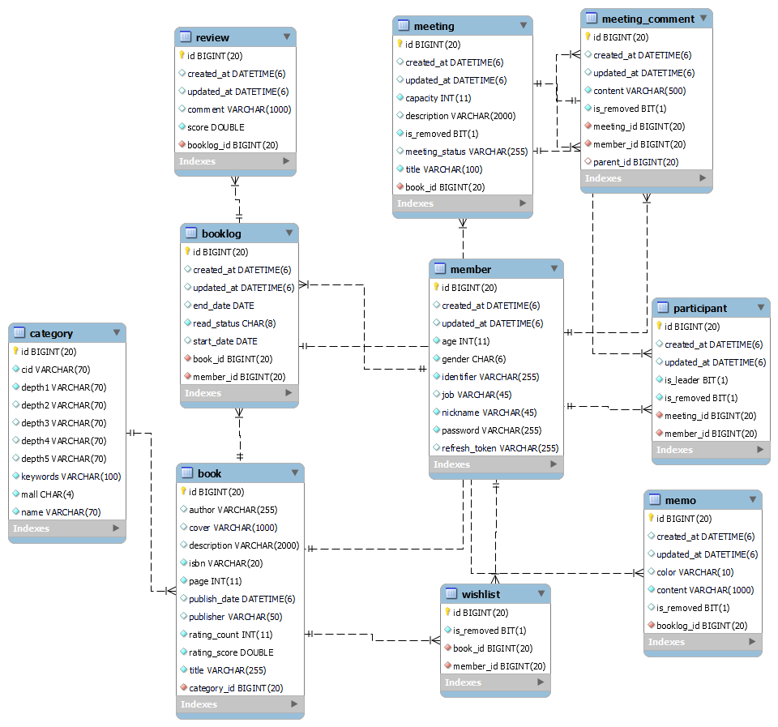

# README

# 책크인 (CHAEK-IN)

## 1. 서비스 소개

---

### 서비스 개요

- 진행 기간 : 2022.08.29~2022.10.07(6주)
- 한 줄 소개 : 책 속으로 여행이 더 설레게
- 서비스 명 : 책크인(CHAEK-IN)

### 기획 배경

- 내가 읽은 책을 쉽게 기록하고, 좋아할 만한 책을 추천 받고 그것을 바탕으로 다양한 사람들과 독서 모임을 할 수 있는 종합 독서 어플리케이션
    - 유저가 좋아할 만한 책을 유저의 책 선호 데이터를 기반으로 추천
    - 완독 모임, 유저와 비슷한 사람들의 모임 등 다양한 독서 모임 추천
    - 바코드 리더 기술과 ISBN을 활용한 독서 기록
    - OCR 기술을 활용한 간편한 책 속 문장 기록

### 프로젝트 예시

새로 찍을 움짤

1. 초기 화면(평점, 정보)
2. 홈 화면 + 책 읽기(바코드)
3. 책 상세 + 메모

---

1. 책 추천 관련 기능 (책 상세 위에서 보여주니까 여기선 안보여줘도 될 듯)
2. 모임 추천 관련 기능 + 모임 상세 + 모임 댓글
3. 마이페이지

1. 회원 가입, 초기 정보 수집


### 팀원 소개


### UCC

[https://youtu.be/tjm-BSuf-mc](https://youtu.be/tjm-BSuf-mc)

## 2. 기획

---

### ERD



### Figma

[https://www.figma.com/file/UdFN1ZLH4m3ajfb3syvtnu/책크인?node-id=0%3A1](https://www.figma.com/file/UdFN1ZLH4m3ajfb3syvtnu/%EC%B1%85%ED%81%AC%EC%9D%B8?node-id=0%3A1)


### API 명세


## 3. 기술 스택

---

### Architecture


### Frontend


- React : 18.0.0
- React Native : 0.69.5

### Backend


- Spring boot : 2.7.4
- QueryDSL : 1.0.10
- mariaDB : 10.6.8

### Data


- FastAPI : 0.85.0

### Infra


- docker : 20.10.18
- Jenkins : 2.60.3
- redis : 7.0.5

### IDE

- Intellij : 2022.01.03 (community)

## 4. 프로젝트 진행

---

### Git

- Git Flow를 브랜치 전략으로 선정
- Develop 브랜치와 Master 브랜치에 MR을 Merge하면, GitLab Webhook이 발생하고 Jenkins를 이용하여 자동 배포 환경 구현
- Develop 브랜치에 Merge되는 순간 Spring, FastAPI 코드로 Docker Image 생성
- Master 브랜치에 Merge되는 순간 Docker Image를 Run하여 자동 배포
- Git commit convention
  
    ```markdown
    ✨ feat : 기능 (새로운 기능)
    🐛 fix : 버그 (버그 수정)
    ♻ refactor : 리팩토링
    💄 style : 스타일 (코드 형식, 세미콜론 추가: 비즈니스 로직에 변경 없음)
    📝 docs : 문서 (문서 추가, 수정, 삭제)
    ✅ test : 테스트 (테스트 코드 추가, 수정, 삭제: 비즈니스 로직에 변경 없음)
    🔨 chore : 기타 변경사항 (빌드 스크립트 수정 등)
    ```
    

### Jira

- 개발 일정 관리


### Notion

[https://pear-alder-eb9.notion.site/87831935456e4da7a1d9b9e7a05c92cd](https://www.notion.so/87831935456e4da7a1d9b9e7a05c92cd)


## 5. 느낀점

---

### 김혜린

처음으로 React Native와 Expo를 활용해 모바일 어플리케이션을 개발하는 새로운 경험이었다. Vue3와 마찬가지로 한글 자료가 많지 않아서 초기 설정부터 외국 유튜브 영상으로 공부하고 시작해서 잘 실행이 될까 걱정도 됐지만 결국 서비스를 끝까지 만들고 출시할 수 있어 뿌듯했다. Google Cloud Vision API를 활용해 OCR 기술을 구현해 본 것도 뜻깊은 경험이었다. 이전의 프로젝트들과 달리 프로젝트 중간에 기획에 변경이 많았는데, 어려운 순간들도 있었지만 열심히 기획을 다잡는데 참여해준 팀원들 덕분에 좋은 서비스를 만들 수 있었던 것 같다.

### 김인태

Python과 Fast API를 이용해 추천 서버를 구성해보았다. JAVA와 Spring FrameWork를 주로 이용해 백엔드 서버를 구축한 나에게는 새로운 경험과 도전이 되었다. 추천 서버 구성 과정에서 추천에서 오랜 연산 시간으로 인해 서버가 다운되는 어려움이 있었다. 이를 해결하기 위해 추천 연산의 갱신이 필요하지 않는한 기존의 연산 결과를 저장하고 이를 캐시처럼 이용하면 응답시간을 줄일 수 있을거라 생각했다. 그래서 캐시 서버로 redis를 적용해 보았고 30초 걸리던 응답시간을 약 0.01초로 대폭 줄일 수 있었다.

응답시간을 줄였지만 로컬에서 사용하던 redis를 Docker 환경으로 올리는 과정에서 추천 서버와 캐시 서버가 연결이 되지 않는 문제를 겪었다. 원인은 Docker 설정과 redis 설정이 맞지 않아서였고 설정을 맞춰준 후 연결이 정상적으로 이루어졌다. 이 과정에서 Jenkins와 Docker 를 이용한 CI / CD 과정을 새로이 배울 수 있었다.

데이터 서버와 캐시 서버가 정상적으로 연결된 이 후 에는 캐시 서버에 등록된 key가 주기적으로 삭제되고 이상한 키가 등록되는 문제가 있었다. 검색을 통해 확인해 본 결과 Docker에 redis 설정 시 비밀번호를 설정하지 않으면 크롤러봇에 의해 key와 value가 삭제되고 악의적인 스크립트가 등록될 수 있음을 알 수 있었다. 이러한 내용을 알게된 후 redis 비밀번호를 설정하고 봇에 의해 등록된 키를 제거하니 이 후 정상적으로 등록된 키는 삭제되지 않았다.

이 외에도 로그인한 사용자만 추천 서비스를 이용할 수 있도록 Fast API에 JWT Dependency를 주입하였다. 동작 과정을 설명하자면 JAVA 백엔드 서버에서 로그인을 통해 키가 발급된다. 이 후 키를 클라이언트가 가지고 있다 추천 요청 시 헤더에 Authorization으로 담아 보내 준다. 그러면 Fast API의 엔드포인트에서 이를 Dependency로 받아 검증하고 통과한 사용자만 서비스를 이용할 수 있는 구조이다.

하지만 어떤 이유에서인지 검증이 실패되어 서비스가 동작하지 않았다. 원인을 찾기 위해 에러 로그를 분석 하였고 Python JWT 라이브러리 내부에서 엔드포인트로 넘어온 Authorization을 복호화 해서 얻은 내용 중 시그니쳐라는 정보와 복호화를 위해 등록한 시크릿 키의 정보가 일치하지 않아 발생하는 문제임을 알 수 있었다. 실제로 시그니쳐와 키를 매칭하는 코드를 주석처리하니 복호화 된 인증 정보에서 필요한 사용자 정보는 얻을 수 있었다.

JAVA 백엔드 서버에서 토큰 발급시 사용한 키와 Fast API 백엔드 서버에서 토큰 복호화를 위해 사용한 키가 동일한데 복호화가 이루어지지 않는 점은 이상했다.

개발 시간 상의 문제로 검증 단계를 주석 처리하여 편법으로 넘어갈 수 있었다. 하지만 그렇게 되면 인증의 의미가 사라져 인증을 제거하고 사용자 id를 넘겨주어 서비스는 정상 작동하도록 하였다.

이 부분을 당시에 해결하지 못한 것은 아쉬운 점이다. 하지만 이 과정에서 로그를 통해 원인을 찾을 수 있음을 배웠고, 라이브러리 내부를 확인하고 원인을 실제로 발견함으로써 막연한 두려움으로 공식 라이브러리 내부를 확인하지 않는 것을 이겨낼 수 있었다.

짧은 개발 시간으로 인해 아쉬운 점도 많았지만 좋은 팀원들을 만나 새로운 것을 도전하고 배울 수 있아 매우 뜻깊고 감사한 시간이었다.

### 김현교

Jenkins와 Docker를 이용하여 CI / CD 환경을 구축하고, EC2를 관리하며 아키텍처 지식을 향상 시킬 수 있었다. 그리고 이전 프로젝트보다 로깅도 강화하고, JPA Batch Insert 문제 등을 겪으며 기술적으로 더 깊이를 가져갈 수 있었다. 이런 저런 일정으로 인해 초기에 기획한 서버 성능 테스트 등을 수행하지 못해 아쉽고 다음 프로젝트에서는 반드시 성능을 체크하고 개선하며 서버 개발자로서 한 층 더 성장하고 싶다.

### 김희영

### 이승훈

갈아넣었다

### 임완택

추천 해봐야지 해봐야지 해 놓고 안 하다가 드디어 하게 됐다. 추천 알고리즘은 간단했다. 콜드스타트 문제가 왜 생기는 줄 알았다. 개인 추천을 위해서는 사용자 데이터가 정말 중요하다는 것을 느꼈다. 중간에 모임 추천 기능이 추가돼서 하이브리드 알고리즘을 못 쓴 것이 아쉽다. FastAPI를 처음 써봤다. 레퍼런스가 별로 없어서 헤맸지만 어려운 기능을 쓴 게 아니라 나름 금방한 것 같다. 추천 결과를 응답해주는데 연산 시간이 많이 걸려서 현교, 인태 형이 redis를 쓰자 했다. 잘한 것 같다. 응답이 빨랐다, 인태 형의 집요함으로 redis를 정복했다. 나는 정복 안 했다. React Native도 처음 써봤다. 근데 내가 한 부분은 CSS만 만져서 그런지 React와 다를 게 없었다. 다음 프로젝트에서 프론트엔드에 전력을 다해야겠다. 여러 기술을 사용할 수 있어서 재밌었다.